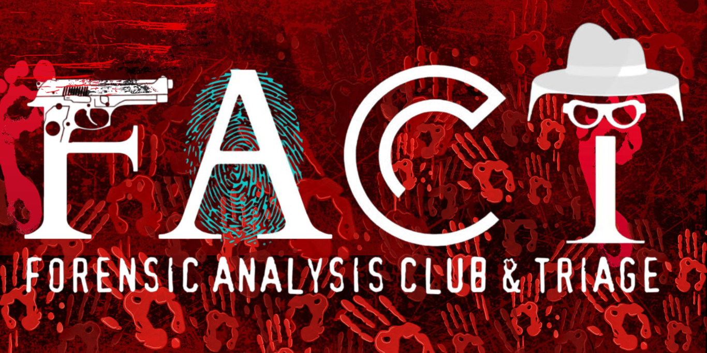

# 🔍 FACT 2025 Recruitment Portal  

<div align="center">



**An immersive detective-themed recruitment portal by the FACT Community (Forensics and CyberSecurity Club).**

[🚀 Live Demo](https://fact-amrita.github.io/FACT_25_recruitment) • [📖 Documentation](#documentation) • [🤝 Contributing](#contributing)

</div>

---

## 📖 About  

The **FACT 2025 Recruitment Portal** is an interactive web application designed to onboard new members of the FACT Community. Built with a detective-themed interface, it challenges candidates to solve cases and submit evidence—making recruitment engaging and reflective of our focus on **forensics and cybersecurity**.  

### ✨ Key Features  

- 🕵️ **Case-Based Interface** – Solve mysteries and gather evidence  
- ⏱️ **Real-time Timer** – Track progress dynamically  
- 📊 **Evidence Dashboard** – Manage case files effectively  
- 📱 **Responsive Design** – Optimized across devices  
- 🎨 **Modern UI/UX** – Smooth, professional interface  
- 🔒 **Secure Forms** – Robust validation and handling  
- 🌙 **Dark/Light Mode** – Theme adaptability  

---

## 🛠️ Tech Stack  

- **React 18** – Frontend framework  
- **TypeScript 5** – Type-safe development  
- **Vite** – Fast build tool & dev server  
- **Tailwind CSS** – Utility-first styling  
- **shadcn/ui + Radix UI** – Modern, accessible components  
- **Framer Motion** – Animations  
- **React Hook Form + Zod** – Form management & validation  
- **TanStack Query** – Data synchronization  
- **Recharts** – Visualization  

Deployment via **GitHub Pages** with **SWC** compilation.  

---

## 🚀 Getting Started  

### Prerequisites  
- Node.js v16+  
- npm or yarn  
- Git  

### Installation  
```bash
git clone https://github.com/fact-amrita/FACT_25_recruitment.git
cd FACT_25_recruitment
npm install
npm run dev
|---------|---------|---------|
| **Tailwind CSS** | 3.4.17 | Utility-first CSS framework |
| **shadcn/ui** | Latest | Modern React component library |
| **Radix UI** | Various | Accessible, unstyled UI primitives |
| **Framer Motion** | 12.23.12 | Smooth animations and transitions |
| **Lucide React** | 0.462.0 | Beautiful, customizable icons |

### Form Handling & Validation

| Library | Version | Purpose |
|---------|---------|---------|
| **React Hook Form** | 7.61.1 | Performant form management |
| **Zod** | 3.25.76 | TypeScript-first schema validation |
| **@hookform/resolvers** | 3.10.0 | Form validation resolvers |

### State Management & Data

| Library | Version | Purpose |
|---------|---------|---------|
| **TanStack Query** | 5.83.0 | Powerful data synchronization |
| **React Context** | Built-in | Global state management |

### UI Components & Libraries

<details>
<summary>📦 Complete Component Library List</summary>

- **@radix-ui/react-accordion** - Collapsible content sections
- **@radix-ui/react-alert-dialog** - Modal dialogs for confirmations
- **@radix-ui/react-avatar** - User profile images
- **@radix-ui/react-checkbox** - Form checkboxes
- **@radix-ui/react-dialog** - Modal overlays
- **@radix-ui/react-dropdown-menu** - Context menus
- **@radix-ui/react-navigation-menu** - Navigation components
- **@radix-ui/react-popover** - Floating content
- **@radix-ui/react-progress** - Progress indicators
- **@radix-ui/react-scroll-area** - Custom scrollbars
- **@radix-ui/react-select** - Dropdown selections
- **@radix-ui/react-slider** - Range inputs
- **@radix-ui/react-tabs** - Tab navigation
- **@radix-ui/react-toast** - Notification system
- **@radix-ui/react-tooltip** - Helpful hints

</details>

### Charts & Visualization

| Library | Version | Purpose |
|---------|---------|---------|
| **Recharts** | 2.15.4 | Composable charting library |

### Development Tools

| Tool | Version | Purpose |
|------|---------|---------|
| **ESLint** | 9.32.0 | Code linting and formatting |
| **PostCSS** | 8.5.6 | CSS processing |
| **Autoprefixer** | 10.4.21 | CSS vendor prefixing |
| **TypeScript ESLint** | 8.38.0 | TypeScript-specific linting rules |

### Build & Deployment

| Tool | Version | Purpose |
|------|---------|---------|
| **GitHub Pages** | 6.3.0 | Static site deployment |
| **SWC** | Latest | Fast TypeScript/JavaScript compiler |

---

## 🚀 Getting Started

### Prerequisites

- **Node.js** (v16 or higher)
- **npm** or **yarn**
- **Git**

### Installation

1. **Clone the repository**
   ```bash
   git clone https://github.com/fact-amrita/FACT_25_recruitment.git
   cd FACT_25_recruitment
   ```

2. **Install dependencies**
   ```bash
   npm install
   ```

3. **Start development server**
   ```bash
   npm run dev
   ```

4. **Open your browser**
   Navigate to `http://localhost:8080`

### Available Scripts

| Script | Description |
|--------|-------------|
| `npm run dev` | Start development server |
| `npm run build` | Build for production |
| `npm run build:dev` | Build for development |
| `npm run preview` | Preview production build |
| `npm run lint` | Run ESLint |
| `npm run deploy` | Deploy to GitHub Pages |

---

## 📁 Project Structure

```
FACT_25_recruitment/
├── 📁 public/                 # Static assets
│   ├── 🖼️ Fact_Logo.png      # Brand assets
│   ├── 🖼️ new_home_logo.png
│   └── 🤖 robots.txt
├── 📁 src/
│   ├── 📁 components/         # React components
│   │   ├── 🕵️ CaseBrief.tsx    # Case introduction
│   │   ├── 📊 EvidenceDashboard.tsx # Evidence viewer
│   │   ├── 🎯 HeroSection.tsx   # Landing section
│   │   ├── ⏱️ Timer.tsx        # Countdown timer
│   │   └── 📁 ui/             # shadcn/ui components
│   ├── 📁 hooks/              # Custom React hooks
│   ├── 📁 lib/                # Utility functions
│   ├── 📁 pages/              # Page components
│   │   ├── 🏠 Index.tsx       # Main page
│   │   └── ❌ NotFound.tsx    # 404 page
│   ├── 🎨 App.css            # Global styles
│   ├── ⚛️ App.tsx            # Main app component
│   └── 🚀 main.tsx           # App entry point
├── 🔧 vite.config.ts         # Vite configuration
├── 🎨 tailwind.config.ts     # Tailwind configuration
├── 📦 package.json           # Dependencies & scripts
└── 📖 README.md              # Project documentation
```

---

## 🎨 Design System

### Color Palette
- **Primary**: Detective theme with dark blues and accent colors
- **Background**: Clean whites with subtle grays
- **Accent**: Highlighting important elements

### Typography
- **Font Family**: System fonts for optimal performance
- **Hierarchy**: Clear heading and body text distinction

### Components
- **Consistent Spacing**: 8px grid system
- **Responsive Design**: Mobile-first approach
- **Accessibility**: WCAG 2.1 AA compliant

---

## 🤝 Contributing

We welcome contributions to improve the FACT recruitment portal! Here's how you can help:

### Development Workflow

1. **Fork the repository**
2. **Create a feature branch**
   ```bash
   git checkout -b feature/amazing-feature
   ```
3. **Make your changes**
4. **Test thoroughly**
5. **Commit with clear messages**
   ```bash
   git commit -m "Add amazing feature"
   ```
6. **Push to your fork**
   ```bash
   git push origin feature/amazing-feature
   ```
7. **Open a Pull Request**

### Code Standards

- Follow TypeScript best practices
- Use ESLint configuration
- Write meaningful commit messages
- Add comments for complex logic
- Ensure responsive design

---

## 📄 License

This project is licensed under the **MIT License** - see the [LICENSE](LICENSE) file for details.

---

## 🏢 About FACT

**FACT (Forensics and CyberSecurity Club)** is a student-led community focused on digital forensics, cybersecurity, and ethical hacking. We organize workshops, competitions, and training sessions to help students develop skills in:

- 🔍 Digital Forensics
- 🛡️ Cybersecurity
- 🐛 Ethical Hacking
- 🔐 Cryptography
- 🌐 Network Security

---

## 📞 Contact

- **Organization**: [FACT Community](https://github.com/fact-amrita)
- **Repository**: [FACT_25_recruitment](https://github.com/fact-amrita/FACT_25_recruitment)
- **Issues**: [Report a bug](https://github.com/fact-amrita/FACT_25_recruitment/issues)

---

<div align="center">

**Made with ❤️ by the FACT Community**

*Empowering the next generation of cybersecurity professionals*

</div>
